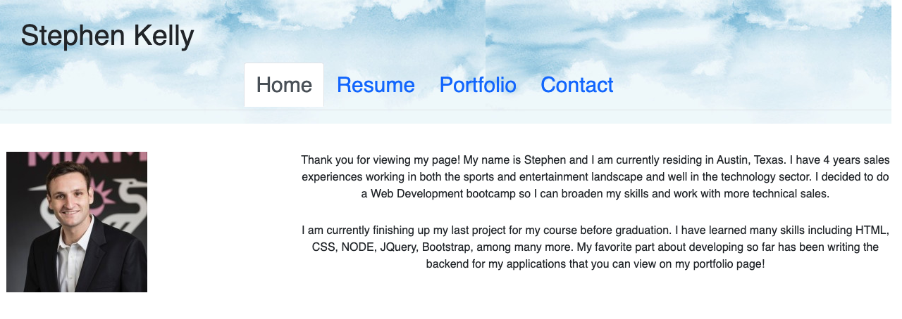

  
# React Portfolio

## Description

This application serves as a snapshot of my current portfolio. It has a downloadable resume tab, a contact tab, and a about me tab.

[Link to deployed application.](https://bright-rabanadas-45789a.netlify.app)

## Table of Contents

- [License](#license)
- [Installation](#installation)
- [Usage](#usage)
- [Contributers](#contributers)
- [Tests](#tests)
- [Questions](#questions)

## License

This application is covered under the MIT license, to learn more about this license, check out: (https://opensource.org/licenses/MIT).

## Installation

Please see below if there are any specific instructions to run this application. 

Run NPM Install in the root folder.

## Usage

Run NPM run develop in the terminal of the root folder

## Contributers

Eric Sayer, Tutor

## Tests

No tests

## Questions

If you would like to learn more about React Portfolio. Check out my github here: (https://github.com/skelly2022)

Feel free to reach me via email if you have any additional questions!

